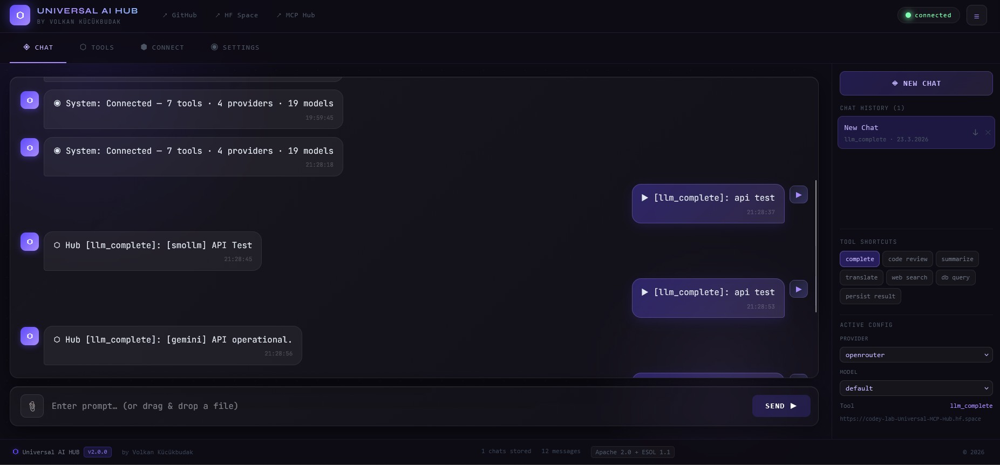

# ⬡ Universal AI Hub - Web Client

A high-performance **Next.js Web App** for interfacing with the **Universal MCP Hub** (aka Universal AI Hub).  
Obsidian Glass UI — built to be deployed directly via **GitHub → Vercel**. No local Node.js environment needed.

## Zero-Bloat Strategy

I don't like local Node.js environments or heavy dependencies. This project is built to be deployed directly via **GitHub to Vercel**. No `npm install` or local `node_modules` required on your machine.

- **Pure Web UI** — Mirrors the logic of [Universal AI HUB](https://github.com/VolkanSah/Universal-MCP-Hub-sandboxed)
- **Direct Connect** — Communicates directly from your browser to your Hub instance
- **Privacy First** — HF Tokens and Hub URLs are stored only in your browser's `localStorage`. Nothing is stored on Vercel.

## Getting Started

1. **Fork & Deploy** — Connect this repo to your [Vercel](https://vercel.com) account. That's it.
2. **Settings** — Enter your `HF_TOKEN` and `HUB_URL` in the Settings tab
3. **Connect** — Hit Connect to fetch your active tools, providers, and models
4. **Chat** — Select tool, provider and model from the sidebar — then prompt away

## Features

- **Obsidian Glass UI** — Dark theme with glassmorphism panels, animated background, shimmer effects
- **Collapsible Sidebar** — Chat history, tool shortcuts, provider & model selection
- **Persistent Chat History** — All conversations stored in `localStorage`, survives page reloads
- **Multi-format Export** — Export any chat session as `.json`, `.txt` or `.csv`
- **File Attachments** — Drag & drop or click to attach: text, code, CSV, JSON, Markdown, images
- **Full Hub Parity** — Same tool/provider/model logic as `hub.py`
- **Dynamic Tool Fetching** — Tools, providers and models loaded live from your Hub on connect
- **Footer** — Live stats, license info, links to GitHub and HuggingFace Space

## File Support

| Format | Web Client | Desktop (`hub.py`) |
|---|---|---|
| Text / Code / MD / JSON / CSV | ✓ | ✓ |
| Images (JPEG, PNG, GIF, WebP) | ✓ | ✓ |
| PDF | ✗ | ✓ |
| ZIP | ✗ | ✓ |
| XLSX | ✗ | ✓ |

For PDF, ZIP and XLSX use the desktop client: [hub.py](https://github.com/VolkanSah/Universal-MCP-Hub-sandboxed)

## How it was built
##### with help of AI

Vercel connected to GitHub, Next.js repo, one `page.tsx`.  
All orginal logic and Design files (5) pushed to Claude AI — forced to keep it micro and find bugs. 😄 and here the result.

---

*Created by Volkan Kücükbudak — 2026*

> This work is dual-licensed under [Apache 2.0](LICENSE) and the Ethical Security Operations License (ESOL v1.1).  
> The [ESOL](ESOL) and [ZERO-TOLERANCE](ESOL_ZERO_TOLERANCE.md) policy are mandatory, non-severable conditions of use.  
> By using this software, you agree to all ethical constraints defined in ESOL v1.1.
